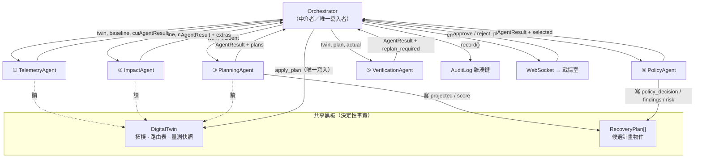

# AegisMesh Agent 通訊與應用演算法規格

> 版本對應：`aegismesh` 0.1.0（5 Agent／7 階段閉環）
> 適用讀者：評審、系統整合者、後續接手開發者
> 本文只描述**程式碼實際做的事**，所有敘述皆可回溯到檔案與行號。

---

## 0. 一句話總結

AegisMesh 的 5 個 Agent **不互相對話**。它們透過一個由 `Orchestrator` 中介的
**共享黑板（數位孿生 + 計畫物件）** 依序協作，每個 Agent 只讀取結構化事實、
只寫入自己被授權的欄位；LLM 只在每個 Agent 的最後一步把事實翻成人話，
它的輸出永遠不會回流成為下一個 Agent 的決策依據。

這個設計是整套系統可信度的來源，也是本文要說明的核心演算法。

---

## 1. 設計前提：為什麼不是 Agent 互相對話

常見的 multi-agent 架構讓 Agent 以自然語言互相傳話（A 的輸出當 B 的 prompt）。
在電信維運場景這個做法有三個致命問題：

| 問題 | 後果 |
|---|---|
| 幻覺會**累積**：A 講錯的數字變成 B 的輸入 | 第 3 個 Agent 的結論已經與實際網路無關 |
| 決策**不可重現**：同樣情境跑兩次得到不同計畫 | 事故後無法還原「當時為什麼這樣切」 |
| 責任**不可歸屬**：錯誤散落在 prompt 之間 | 法遵稽核無法審查治理邏輯 |

AegisMesh 因此把 Agent 之間的通訊全部改為**型別化的結構資料**，並把
「誰有權寫什麼」寫死在程式碼裡。用一句話講清楚邊界：

> **LLM 從頭到尾沒有權限決定路徑、頻寬或核准與否。**
> 它說錯話不會導致錯誤的網路變更。

---

## 2. 角色與職責

| # | Agent | stage | 決定性核心（真正做決策的東西） | LLM 負責 |
|---|---|---|---|---|
| ① | `TelemetryAgent` | `observe` | 門檻式異常偵測（比對 baseline 與 current 量測值） | 事故播報文字 |
| ② | `ImpactAgent` | `assess` | 業務／SLA 對照（誰從 met 掉到 not met） | 業務衝擊說明 |
| ③ | `PlanningAgent` | `plan+simulate` | `optimizer.generate_plans()` ＋ 影子孿生推演 ＋ `score_plan()` 排序 | 推薦理由與代價 |
| ④ | `PolicyAgent` | `govern` | `PolicyEngine` 對 `policies.yaml` 的規則評估 | 核准說明 |
| ⑤ | `VerificationAgent` | `verify` | 預測 vs 實測比對、`replan_required` 判定 | 驗收結論 |

非 Agent 但參與通訊的元件：

- `Orchestrator` —— 中介者。**唯一有權變更網路狀態的元件**（`twin.apply_plan()` 只在這裡被呼叫）。
- `DigitalTwin` —— 共享黑板。所有量測值的唯一來源，零 LLM。
- `AuditLog` —— 只增不刪的雜湊鏈，記錄每一次通訊。
- `DemoSession`（`api/server.py`）—— 把同步閉環橋接到非同步 WebSocket。

---

## 3. 通訊模型總覽



**關鍵不對稱**：Agent 對孿生只有讀權限，寫入必須經過 `Orchestrator`；
而 `Orchestrator` 只會執行「通過政策 ＋（必要時）經人工核准」的計畫。

---

## 4. 資料契約

### 4.1 `AgentResult` —— 所有 Agent 的統一回傳格式

`aegismesh/agents/base.py`

```python
@dataclass
class AgentResult:
    agent: str            # Agent 名稱
    stage: str            # observe | assess | plan+simulate | govern | verify
    facts: dict           # ★ 決定性事實：引擎／最佳化器／政策引擎算出來的
    narrative: str        # ☆ LLM 敘述（離線時由樣板產生）
    llm_mode: str         # 這一筆敘述是誰寫的（模型名稱 or "offline"）
    extras: dict          # 控制訊號（見 §5 通道 D）
```

**`facts` 與 `narrative` 的分界就是信任邊界**：

- `facts` 進稽核軌跡、進不變式測試、可被重算驗證。
- `narrative` 只進 UI 與稽核軌跡的說明欄位，**沒有任何下游程式讀它**。

`llm_mode` 讓每一筆敘述都能標示來源，離線時值為 `offline` 並附 `_llm_reason`。

### 4.2 `RecoveryPlan` —— 跨 Agent 的共享工件（欄位所有權）

計畫物件是唯一被多個 Agent 依序寫入的物件。**每個欄位只有一個合法寫入者**：

| 欄位 | 寫入者 | 時機 | 下游讀取者 |
|---|---|---|---|
| `id` / `strategy` / `summary` / `actions` | `optimizer.generate_plans()` | Plan | 政策引擎、孿生、UI |
| `projected` | `optimizer.simulate()`（影子孿生） | Simulate | 政策引擎、Verification、UI |
| `score` | `PlanningAgent` ← `score_plan()` | Plan 後 | 計畫選擇（`max(score)`） |
| `llm_rationale` | `PlanningAgent` ← LLM | Plan 後 | **僅 UI／稽核，無程式邏輯讀取** |
| `policy_decision` | `PolicyEngine.apply_to()` | Govern | Orchestrator 的核准閘門 |
| `policy_findings` | `PolicyEngine.apply_to()` | Govern | 人工核准對話框、稽核 |
| `risk_score` | `PolicyEngine.apply_to()` | Govern | UI、稽核 |

`policy_decision` 之所以不可能被 LLM 竄改，是因為它**根本不經過 LLM**：
`PolicyAgent` 拿到的 `decision` 是規則引擎回傳值，LLM 只被要求輸出 `{"briefing": ...}`。

### 4.3 `NetworkSnapshot` —— 黑板上的量測結果

由 `DigitalTwin.evaluate()` 產生，所有 Agent 讀同一份格式：
每個業務的 `path / admitted_mbps / latency_ms / loss_pct / slo_met / violations`，
每條鏈路的 `state / utilization_pct / load_mbps / latency_ms / loss_pct`，
以及三個彙總指標 `critical_availability_pct`、`slo_compliance_pct`、`monthly_cost_ntd`。

---

## 5. 六條通訊通道

| 通道 | 方向 | 載體 | 內容 | 是否可被 LLM 影響 |
|---|---|---|---|---|
| **A 黑板讀取** | Orchestrator → Agent | 函式引數 `twin, baseline, current` | 拓樸、路由表、量測快照 | ✗ |
| **B 回傳值** | Agent → Orchestrator | `AgentResult`、`plans`、`selected` | 事實 ＋ 敘述 | 僅 `narrative` |
| **C 計畫欄位** | Agent → Agent（間接） | `RecoveryPlan` 物件 | 推演結果、評分、政策裁決 | 僅 `llm_rationale` |
| **D 控制訊號** | Agent → Orchestrator | `AgentResult.extras` | `replan_required`、`restore_first` | 見下方說明 |
| **E 事件流** | Orchestrator → UI | `emit(kind, payload)` 回呼 | 9 種事件（見 §10） | ✗（單向廣播） |
| **F 稽核軌跡** | Orchestrator → 檔案 | `AuditLog.record()` | 每階段完整 payload ＋ SHA-256 | ✗（只增不刪） |

### 通道 D 的兩個控制訊號

```python
# VerificationAgent —— 唯一會改變控制流的訊號
replan_required = not (actual.critical_availability_pct >= 100.0 - 0.1)
```

`replan_required` 完全由量測值決定，LLM 碰不到；`Orchestrator` 讀到 `True`
就重跑整個閉環（§8）。

```python
# ImpactAgent —— LLM 輸出唯一會跨越 Agent 邊界的欄位
restore_first = out.get("restore_first") or []
restore_first = [s for s in restore_first if s in twin.services]   # ← 用引擎事實過濾
```

即使 LLM 幻覺出不存在的 `service_id`，也會在這裡被濾掉。
**目前 `restore_first` 僅寫入稽核與 UI，最佳化器並不消費它** ——
規劃順序一律由 `Service.priority` 決定。這是刻意的：連「建議先救誰」都不讓 LLM 影響實際分配。

### 為什麼 LLM 幻覺無法擴散

每次 LLM 呼叫都是**無狀態**的：只有 `system_prompt` ＋ 當次 `user_prompt`，
沒有對話歷史、沒有跨 Agent 記憶（`llm.py:78-87`）。
5 個 Agent 各自呼叫一次，彼此看不到對方的敘述。因此：

> 幻覺的爆炸半徑 = 一段顯示文字，且該文字不進入任何後續計算。

---

## 6. 主控演算法（`Orchestrator.run()`）

```
輸入：scenario, approval_fn, max_rounds=2, on_stage 回呼
輸出：LoopResult

# --- 前置：建立基準線 ---
twin.clear_faults(); twin.reset_routing()
baseline ← twin.evaluate("baseline")
audit.record("baseline", "DigitalTwin", baseline)
emit("baseline", baseline)

# --- 注入故障（等同真實環境的 ip link / tc netem）---
twin.apply_faults(scenario.faults); twin.tick += 1
incident ← twin.evaluate("incident")
audit.record("fault_injection", "Scenario", {faults, netem 指令, snapshot})
emit("incident", incident)

for round in 1..max_rounds:
    current ← twin.evaluate(f"round-{round}")

    ① r ← telemetry.run(twin, baseline, current)          # Observe
       audit.record(r); emit("agent", r)

    ② r ← impact.run(twin, baseline, current)             # Assess
       audit.record(r); emit("agent", r)

    ③ r, plans ← planning.run(twin, current)              # Plan + Simulate
       audit.record(r); emit("agent", r)
       if plans 為空: halt("最佳化器找不到任何可行復原路徑"); break

    ④ r, selected ← governance.run(twin, plans, current)  # Govern
       audit.record(r); emit("plans", …); emit("agent", r)
       if selected 為 None: halt("所有候選計畫皆被治理政策拒絕"); break

    ⑤ needs_human ← require_approval ∧ (selected.policy_decision ≠ ALLOW)
       approved   ← approval_fn(selected) if needs_human else True
       audit.record("approve", "Human" or "PolicyEngine", {決策, 風險, 發現})
       emit("approval", …)
       if ¬approved: halt("人工核准遭拒，網路維持事故當下狀態"); break

    ⑥ applied ← twin.apply_plan(selected)                 # Execute ★唯一變更網路的一步
       twin.tick += 1
       audit.record("execute", "Orchestrator", {plan_id, applied})
       emit("execute", …)

    ⑦ final ← twin.evaluate(f"verified-round-{round}")    # Verify
       r ← verification.run(twin, baseline, incident, selected, final)
       audit.record(r); emit("agent", r)

       if ¬r.extras["replan_required"]: break             # 成功收斂
       if round ≥ max_rounds: halt("連續 N 輪未恢復，升級人工"); break
       emit("replan", {round})                            # 回到 ①

audit.record("loop_complete", "Orchestrator", result.summary())
```

**三個中止點（halt）都是 fail-safe**：任何一個觸發，網路都維持在事故當下的狀態，
不會執行一個未被驗證的變更。

**`announce()` 的存在理由**：每個 Agent 的敘述要等一次 LLM 往返（實測 1.5–2.5s），
`emit("agent_start", …)` 先讓 UI 知道哪個 Agent 開跑，避免畫面看起來像當掉。

---

## 7. 各 Agent 的內部演算法

所有 Agent 共用同一個骨架（`base.py`）：

```python
def run(...) -> AgentResult:
    facts = <決定性計算>              # 1. 算事實
    def fallback(): ...              # 2. 準備離線樣板
    out = self._ask(prompt, fallback) # 3. 問 LLM（失敗就退回樣板）
    return AgentResult(facts=facts, narrative=out[...], ...)
```

順序很重要：**事實先算完，才問 LLM**。所以 LLM 逾時、金鑰失效、回傳格式錯誤，
都不會改變 `facts`。

### ① TelemetryAgent —— 門檻式異常偵測

對每條鏈路比對 `baseline` 與 `current`，命中即產生一筆 anomaly：

| 判定 | 條件 | 嚴重度 |
|---|---|---|
| `link_down` | `state == "down"` | CRITICAL |
| `latency_spike` | 有注入延遲 ∧ `now.latency > base.latency × 2.0` | WARNING |
| `capacity_loss` | `netem_capacity_factor < 1.0` | WARNING |
| `congestion` | `utilization_pct ≥ 75%` | WARNING |
| `packet_loss` | `now.loss > max(0.1, base.loss × 3)` | WARNING |

整體嚴重度：有 `link_down` 或有業務失聯 → CRITICAL；有任何 anomaly → WARNING；否則 OK。

> 注意 `backbone-brownout` 情境：沒有任何鏈路 down，傳統告警不會響，
> 但 `latency_spike` ＋ `packet_loss` 仍會觸發 —— 這是「隱性事故」的偵測路徑。

複雜度 `O(|L|)`。

### ② ImpactAgent —— 網路指標 → 臨床衝擊的翻譯

```
for 每個業務 sid:
    was_ok ← baseline.services[sid].slo_met
    if was_ok ∧ now.slo_met: 跳過        # 沒變差就不算受影響
    impacted += {name, priority, critical, clinical_note, violations, admitted_mbps}
impacted.sort(by priority)               # P0 排最前面
```

輸出 `critical_impacted`（P0/P1 清單）與 SLA 達成率的前後對照。
複雜度 `O(S log S)`。

### ③ PlanningAgent —— 最佳化 ＋ 影子推演（決策的可驗證核心）

這是整套系統唯一「產生動作」的地方，**完全沒有 LLM 參與**。

```
plans ← generate_plans(twin)
for p in plans: p.score ← score_plan(incident, p.projected, p)
plans.sort(by score desc)
best ← plans[0]
```

`generate_plans()` 對三種策略各跑一次四階段管線：

| 策略 | `util_target` | `queue_budget` | `cost_weight` | `protect_priority` |
|---|---|---|---|---|
| `protect_critical` 生命關鍵優先 | 80% | 0.8 | 0.10 | P1 |
| `balanced` 均衡 | 88% | 1.5 | 0.45 | P0 |
| `lowest_cost` 成本最小化 | 92% | 3.0 | 0.85 | P0 |

**階段 1 — 路徑排序 `_rank_paths()`**

把「延遲 SLO」翻譯成「容量約束」的關鍵一步：

```
ρ_cap = min(util_target, queue_budget / (1 + queue_budget))
```

推導自 M/M/1：排隊延遲 `= base·ρ/(1−ρ)`，要讓它不超過 base 的 K 倍
必須 `ρ ≤ K/(1+K)`。因此高基礎延遲的鏈路（衛星 48ms、壅塞 5G）會被**自動保守分配**。

路徑評分：`(1−cost_weight)·正規化延遲 + cost_weight·正規化成本 + 1000·不可行懲罰`
（基礎延遲已超過 SLO 的路徑直接淘汰，因為加上排隊只會更差）。

**階段 2 — 優先級允入控制 `_greedy_allocate()`**

按 `priority` 由高到低逐一裝箱，維護每條鏈路的殘餘容量。兩層預算：

- `soft = capacity × ρ_cap` —— 延遲導向的保守上限（所有業務）
- `hard = capacity × util_target` —— 容量硬上限（**僅受保護業務**可動用）

寧可延遲吃緊也不讓生命關鍵業務斷線；是否真的守得住 SLO，交給階段 4 實際推演確認。

**階段 3 — 優先級反轉修復 `_priority_repair()`**

貪婪裝箱會產生一種對醫院不可接受的結果：
*HIS 批價（P3，需 10M）擠不進去，但訪客 Wi-Fi（P4，需 5M）剛好塞得下。*

```
for svc（依優先級由高到低）:
    if svc 已獲配頻寬: 跳過
    donors ← {更低優先級 ∧ 有頻寬 ∧ 與 svc 共用鏈路的業務}，由最不重要者排前
    if Σ donors 頻寬 ≥ svc.min_bandwidth:
        全數回收 → 配給 svc                    # 回收
    else:
        全數回收 → 但 svc 仍為 0               # 級聯停用
```

級聯停用維持的不變式：**「沒有人比我更該被服務」**。
（`test_no_priority_inversion_in_any_plan` 守住這一點。）

**階段 4 — 迭代壅塞收斂 `_refine()`**（最多 12 輪）

```
repeat ≤ 12 次:
    shadow ← twin.clone(); 套用 paths/admitted; snap ← shadow.evaluate()
    failing ← {關鍵業務 ∧ 可達 ∧ ¬slo_met}
    if failing 為空: break                                    # 收斂

    hot ← {failing 路徑上 utilization ≥ 45% 的鏈路}
    if hot 為空: break        # 延遲問題不是壅塞造成的，限流無濟於事

    victim ← 第一個「頻寬高於下限 ∧ 與 hot 有交集」的業務
              （排序：低優先級優先，同級則吃頻寬多者優先）
    if victim 為 None: break
    admitted[victim] ← max(floor(victim), admitted[victim] × 0.5)   # 折半降速
```

兩個關鍵設計：

1. **犧牲對象必須與受害者共用熱點鏈路** —— 去限流一個走衛星的行政系統，
   對 5G 上的壅塞毫無幫助。
2. **受保護業務也能被降到 `min_bandwidth`** —— 壅塞常常是受保護業務彼此排擠造成的，
   若完全禁止動它們，迴圈會卡住而讓關鍵業務全數失守。

每一輪都真的重新推演，所以計畫的預測值是**驗證過的**，不是估的。

**階段 5 — 動作生成、推演、去重**

`_build_actions()` 比對新舊路由表產生 `reroute` / `throttle` / `admit` 動作；
`simulate()` 在 `twin.clone()` 上套用計畫並 `evaluate()`，結果寫入 `plan.projected`；
`_dedupe()` 移除動作完全相同的計畫（避免評審看到三個一樣的方案）。

**評分函式**（`score_plan`）：

```
0.60 × 關鍵可用率增益
+ 0.25 × 整體 SLA 增益
− 0.15 × (成本增額 / 1000)
− 0.40 × 動作數量
```

權重把「救命 > SLA > 省錢」寫死在程式裡，而不是寫在 prompt 裡。

### ④ PolicyAgent —— 沒有裁量權的守門人

```
for plan in plans: PolicyEngine.apply_to(twin, plan, incident)   # 寫回 plan 三個欄位
eligible ← [p for p in plans if p.policy_decision ≠ DENY]
selected ← max(eligible, key=score) if eligible else None
```

規則評估（`policy/engine.py`）：

```
if plan.projected is None:
    return DENY, [POL-000 計畫未經推演]        # ★ 未經孿生推演一律拒絕

findings ← [命中的規則]
decision ← 所有 findings 中最嚴厲者            # severity lattice
risk     ← min(100, Σ weight)
```

嚴重度格（`_SEVERITY_ORDER`）：`allow(0) < require_approval(1) < deny(2)`。
沒有任何規則命中才是 `allow`。

| 規則 | kind | effect | weight |
|---|---|---|---|
| POL-000 | 未推演 | deny | 100 |
| POL-001 | `critical_regression` | deny | 40 |
| POL-002 | `priority_inversion` | deny | 30 |
| POL-003 | `critical_floor` | deny | 35 |
| POL-010 | `satellite_activation` | require_approval | 15 |
| POL-011 | `cost_ceiling`（NT$90,000） | require_approval | 12 |
| POL-012 | `cost_multiplier`（3.0×） | require_approval | 10 |
| POL-020 | `blast_radius`（6 動作） | require_approval | 8 |
| POL-021 | `service_suspension`（P3 以內） | require_approval | 18 |

`policies.yaml` 是治理層的唯一真實來源；`engine.py` 只實作有限幾種 `kind`，
遇到未實作的 `kind` 直接 `raise ValueError` —— 政策檔不可能悄悄失效
（`test_every_yaml_rule_kind_is_implemented` 守住）。

### ⑤ VerificationAgent —— 預測 vs 實測

```
for sid in actual.services:
    pred ← plan.projected.services[sid]
    delta ← |pred.latency − act.latency|
    if delta > 5.0ms ∨ pred.slo_met ≠ act.slo_met:
        drift += {sid, 預測值, 實測值}

crit_recovered  ← actual.critical_availability_pct ≥ 99.9
replan_required ← ¬crit_recovered
```

`prediction_drift` 是這套系統最重要的自我檢查指標：
**如果孿生推演不準，「先推演、後執行」的整個主張就站不住腳。**
目前三個情境的 drift 皆為空（`test_verification_compares_prediction_against_measurement`）。

---

## 8. 回饋迴路：重規劃

```
Verify 失敗 → emit("replan") → 回到 ① Observe（帶著已變更的網路狀態）
```

第二輪的 `current = twin.evaluate("round-2")` 反映的是**第一輪執行後**的網路，
所以最佳化器面對的是新的殘餘容量，會收斂到不同的解。
連續 `max_rounds`（預設 2）輪仍未恢復 → `emit("replan_exhausted")` 並升級人工處理。

這是唯一一條由 Agent 觸發的控制流分支，而它的判定條件是純量測值。

---

## 9. 人機通訊：核准閘門

```
needs_human = SETTINGS.require_approval ∧ (selected.policy_decision ≠ ALLOW)
approved    = approval_fn(selected) if needs_human else True
```

三種 `approval_fn` 實作：

| 實作 | 用途 |
|---|---|
| `cli._interactive_approval` | 終端機 Demo，`console.input()` 阻塞 |
| `DemoSession.request_approval` | 戰情室，`threading.Event` 阻塞（逾時 300s → 視為拒絕） |
| `auto_approve` / `auto_reject` | **僅供自動化測試**，真實部署不該使用 |

核准與否連同 `policy_findings`、`risk_score` 一併寫入稽核（actor 為 `Human` 或 `PolicyEngine`），
事後可以還原「值班主管當時看到什麼、按了什麼」。

---

## 10. 事件通道與執行緒橋接

閉環是同步阻塞流程（人工核准本來就該阻塞），WebSocket 是非同步的。橋接方式：

```
orchestrator.run()  ← 跑在 worker thread（asyncio.to_thread），approval_fn 在此阻塞
    │ emit(kind, payload) → loop.call_soon_threadsafe(queue.put_nowait, msg)
    ▼
asyncio.Queue → pump task → WebSocket → 瀏覽器
    │
    └─ 按下「核准」→ threading.Event.set() → 解除 worker 阻塞
```

**9 種閉環事件**：

| kind | 時機 | payload 重點 |
|---|---|---|
| `baseline` / `incident` | 前置階段 | 完整 `NetworkSnapshot` |
| `agent_start` | 每個 Agent 開跑前 | `{agent, stage}`（避免 LLM 往返期間畫面空白） |
| `agent` | 每個 Agent 完成 | 完整 `AgentResult` |
| `plans` | Govern 之後 | 所有候選計畫 ＋ 政策裁決 ＋ `selected` |
| `approval` | 核准閘門 | `{plan_id, approved, human_gate}` |
| `execute` | 執行後 | 實際生效的動作清單 |
| `replan` / `replan_exhausted` | Verify 失敗 | `{round}` |

另有 session 層級事件：`started`、`finished`、`approval_request`、`error`、`pong`。

**`plans` 必須在 `agent` 之前發布**：政策裁決要先寫回計畫物件，UI 拿到的表格才是完整的
（`orchestrator.py:197-198`）。

**為什麼是 `threading.Event` 而不是 `asyncio.Future`**：
早期版本走 `run_coroutine_threadsafe`，瀏覽器在核准前關掉分頁時，worker thread 會卡滿
5 分鐘逾時才醒來 —— 因為結果的「送達」依賴事件迴圈還活著。反覆重整就會累積殭屍執行緒。
`test_disconnect_before_approval_does_not_leak_worker_threads` 守住這一點。

每條 WebSocket 連線各自建立一個 `Orchestrator`（各自有獨立的孿生與稽核檔），
多人同時觀看不會互相污染（`test_concurrent_runs_do_not_share_an_audit_file`）。

---

## 11. 稽核通道：雜湊鏈

每一次 Agent 通訊都留下一筆不可否認紀錄：

```python
entry = {ts, stage, actor, detail, prev_hash}
entry["hash"] = SHA256(json.dumps(entry, sort_keys=True))
```

一次完整閉環的紀錄序列：

```
baseline → fault_injection → observe → assess → plan+simulate
        → govern → approve → execute → verify → loop_complete
```

驗證方式是重算整條鏈（`AuditLog.verify()`）：
竄改任一筆內容 → 該筆 hash 對不上；刪除任一筆 → 下一筆的 `prev_hash` 斷裂。
兩者皆有測試守住（`test_audit_chain_verifies_and_detects_tampering`、`test_audit_chain_detects_deleted_entry`）。

寫入受 `threading.Lock` 保護，確保多執行緒下 `prev_hash` 與寫入順序的原子性。
稽核檔名帶 `uuid4()[:6]`，避免同一秒內的兩次獨立事故寫進同一個檔案
—— 那會讓查核人員讀到一條從未發生過的連續時間線。

---

## 12. 失效與退化路徑

| 失效 | 系統行為 | 對決策的影響 |
|---|---|---|
| 沒有 `OPENAI_API_KEY` | 全程走 `fallback()` 決定性樣板 | **無**（數值與計畫完全相同） |
| LLM 逾時／JSON 格式錯 | 該次呼叫退回 `fallback()`，記 `_llm_reason` | **無** |
| `AEGIS_ALLOW_OFFLINE_LLM=false` | 拋 `LLMUnavailable`，閉環中止 | 明確失敗，不會靜默降級 |
| 最佳化器找不到路徑 | halt，網路維持事故狀態 | 不執行任何變更 |
| 所有計畫被政策拒絕 | halt，網路維持事故狀態 | 不執行任何變更 |
| 人工拒絕核准 | halt，網路維持事故狀態 | 不執行任何變更 |
| 兩輪仍未恢復 | `replan_exhausted`，升級人工 | 保留已執行的改善 |

LLM 呼叫參數：`timeout=40s`、`max_retries=2`、`temperature=0.2`、
`max_tokens=900`、`response_format={"type":"json_object"}`。
送進去的孿生快照經 `compact_json()` 壓縮並截斷在 6000 字元。

---

## 13. 決定性不變式與對應測試

| 不變式 | 測試 |
|---|---|
| 同一情境跑兩次，`facts` 與最終執行的計畫完全一致 | `test_agent_facts_are_deterministic_across_runs` |
| 無 API key 時整套閉環仍跑得完 | `test_runs_fully_offline_without_api_key` |
| 七個階段全數留下稽核紀錄 | `test_loop_runs_all_seven_stages` |
| 拒絕核准 → 不得出現 `execute` 紀錄 | `test_rejected_approval_halts_execution` |
| 未經推演的計畫一律 DENY | `test_unsimulated_plan_is_denied` |
| 政策裁決取所有 findings 中最嚴厲者 | `test_policy_decision_is_worst_of_all_findings` |
| 任何計畫都不得有優先級反轉 | `test_no_priority_inversion_in_any_plan` |
| 任何鏈路都不得超賣 | `test_no_link_is_oversubscribed` |
| 分配頻寬不超過業務所需 | `test_admitted_bandwidth_never_exceeds_requirement` |
| 影子孿生與線上孿生完全隔離 | `test_clone_is_isolated_from_live_twin` |
| 稽核鏈可偵測竄改與刪除 | `test_audit_chain_verifies_and_detects_tampering` |
| 併發執行不共用稽核檔 | `test_concurrent_runs_do_not_share_an_audit_file` |

---

## 14. 複雜度

符號：`S` 業務數（6）、`L` 鏈路數（13）、`V` 節點數（12）、`k` 候選路徑數（4）、
`R` 政策規則數（8）、`T` refine 上限（12）、`P` 策略數（3）。

| 步驟 | 複雜度 | 實際規模 |
|---|---|---|
| `candidate_paths`（Yen's k-shortest） | `O(k·V·(L + V log V))` per service，每輪規劃只算一次並由三策略共用 | 24 條路徑 |
| `twin.evaluate()` | `O(S·L + L)` | < 1ms |
| `_greedy_allocate` | `O(S·k·L)` | — |
| `_priority_repair` | `O(S²·L)` | — |
| `_refine` | `O(T·(S·L + L))`（每輪含一次 clone + evaluate） | ≤ 12 輪 |
| `generate_plans` | `P ×` 上述 ＋ `P` 次 `simulate()` | 3 個計畫 |
| `PolicyEngine.evaluate` | `O(R·S²)`（最壞來自 `priority_inversion` 的巢狀比對） | — |
| **決定性部分總計** | 毫秒級 | **實測 7.2–7.9ms**／完整閉環（含稽核寫檔） |
| **LLM 部分** | 每輪 **5 次**獨立呼叫，各 1.5–2.5s | 主導端到端時間 |

實測（離線模式，`auto_approve`，含 baseline → 故障注入 → 5 個 Agent → 執行 → 驗證 → 稽核寫檔）：

```
typhoon-fiber-cut         7.9 ms   rounds=1  succeeded=True
earthquake-dual-loss      7.5 ms   rounds=1  succeeded=True
backbone-brownout         7.2 ms   rounds=1  succeeded=True
```

換句話說：**閉環的決定性核心快到可以忽略，端到端時間幾乎全是 LLM 敘述的往返。**
5 次 LLM 呼叫約佔 8–12 秒，決定性決策佔不到 0.1%。

---

## 15. 擴充指南

### 新增一個 Agent

1. 繼承 `agents/base.py:Agent`，設定 `name` / `stage` / `system_prompt`。
2. `run()` 先算 `facts`（只讀 `twin` 與快照），再定義 `fallback()`，最後 `self._ask()`。
3. 需要影響控制流時，透過 `extras` 回傳訊號，且該訊號**必須由 facts 推導**，不可取自 LLM 輸出。
4. 在 `Orchestrator.run()` 插入呼叫，並補上 `announce()` / `audit.record()` / `emit()` 三件套。
5. 若新增了 emit kind，於 `api/server.py:_serialize()` 補序列化分支。

### 新增一條治理規則

1. 在 `policies.yaml` 加入 `{id, name, kind, effect, weight, params, description}`。
2. 在 `policy/engine.py:_eval_rule()` 實作對應 `kind`，命中回傳說明字串、未命中回傳 `None`。
3. `test_every_yaml_rule_kind_is_implemented` 會自動驗證兩者同步。

### 替換孿生為真實網路

`Fault.netem_command()` 已經輸出可直接執行的 Linux 指令：

```bash
$ ip link set dev eth0 down                                    # w-fiber 光纖中斷
$ tc qdisc replace dev eth0 root netem delay 25ms loss 0.25% rate 240mbit   # w-5g 壅塞
```

把 `DigitalTwin` 換成 containerlab adapter 時，**上層的 Agent、最佳化器、
政策引擎、通訊協定完全不需要改** —— 因為它們只依賴 `evaluate()` / `apply_plan()` /
`clone()` / `candidate_paths()` 這四個介面。

---

## 16. 已知限制

1. **Agent 為嚴格順序執行，無平行化**。Observe 與 Assess 在資料上其實互相獨立
   （都只讀 `baseline` 與 `current`），可平行呼叫以省下一次 LLM 往返；目前為求
   稽核序列的可讀性而維持順序。
2. **`restore_first` 尚未被下游消費**。ImpactAgent 給出的優先恢復建議目前只進稽核與 UI，
   最佳化器一律依 `Service.priority` 排序。若未來要讓它影響分配，必須先設計
   「LLM 建議如何被規則約束」的機制，否則會破壞本文 §5 的信任邊界。
3. **`max_rounds` 預設為 2**。重規劃收斂性依賴每輪都能釋出新的殘餘容量；
   極端情境（例如衛星也中斷）下會直接走到 `replan_exhausted`。
4. **LLM 敘述無跨 Agent 一致性檢查**。5 段敘述由 5 次獨立呼叫產生，理論上可能
   在措辭上互相矛盾（數值不會，因為都來自同一份 facts）。
5. **政策規則的 `kind` 是封閉集合**。這是刻意的取捨：可稽核性優先於表達力，
   新增規則種類必須改程式並過測試。

---

## 附錄：一次完整閉環的通訊軌跡（`typhoon-fiber-cut`，實際執行結果）

以下為離線模式實跑一次的稽核軌跡（10 筆），數值取自 `audit-*.jsonl`：

```
 #  stage            actor               facts 摘要
─────────────────────────────────────────────────────────────────────────────────
 1  baseline         DigitalTwin         關鍵可用率 100% · SLA 100% · NT$19,829/月
 2  fault_injection  Scenario            w-fiber DOWN；w-5g DEGRADED(40%/+25ms/+0.25%)
                                         → 關鍵可用率 0% · SLA 0%
 3  observe          Telemetry Agent     anomaly_count=4 severity=critical unreachable=6
                                         types=[link_down, latency_spike,
                                                capacity_loss, packet_loss]
 4  assess           Impact Agent        impacted=6  critical_impacted=[svc-ed-vitals,
                                         svc-icu-iot, svc-teleconsult]
 5  plan+simulate    Planning Agent      plan_count=3  recommended=plan-03-lowest_cost
                                         （score 62.5 / 62.4 / 61.6）
 6  govern           Policy Agent        rule_count=8  selected=plan-03-lowest_cost
                                         requires_human_approval=True  risk=45
                                         findings=[POL-010, POL-011, POL-012, POL-020]
 7  approve          Human               human_gate=true  approved=true
 8  execute          Orchestrator        applied=8 個動作（4 條改走 5G、HIS/訪客改走衛星、
                                         PACS 限流至 40M、訪客限流至 10M）
 9  verify           Verification Agent  prediction_drift=0  accurate=True
                                         replan_required=False  關鍵可用率 100%
10  loop_complete    Orchestrator        succeeded=true  rounds=1
```

對照三個候選計畫（同一次執行）：

| 計畫 | 動作 | 關鍵可用率 | SLA | 月成本 | 評分 | 風險 | 政策裁決 |
|---|---:|---:|---:|---:|---:|---:|:--:|
| ▶ `plan-03-lowest_cost` | 8 | 100% | 100% | NT$148,165 | 62.5 | 45 | 需核准 |
| `plan-01-protect_critical` | 9 | 100% | 67% | NT$90,847 | 62.4 | 63 | 需核准 |
| `plan-02-balanced` | 9 | 100% | 83% | NT$124,338 | 61.6 | 45 | 需核准 |

> 三者的關鍵可用率都是 100%（政策紅線都守住了），差別在 SLA 與成本的取捨；
> `score_plan()` 的 0.25 SLA 權重讓 `lowest_cost` 以 0.1 分之差勝出 ——
> 這個排序完全由公式決定，LLM 只是事後解釋它。

驗證這條軌跡沒被動過：

```bash
python -m aegismesh.cli audit runs/audit-*.jsonl
```
